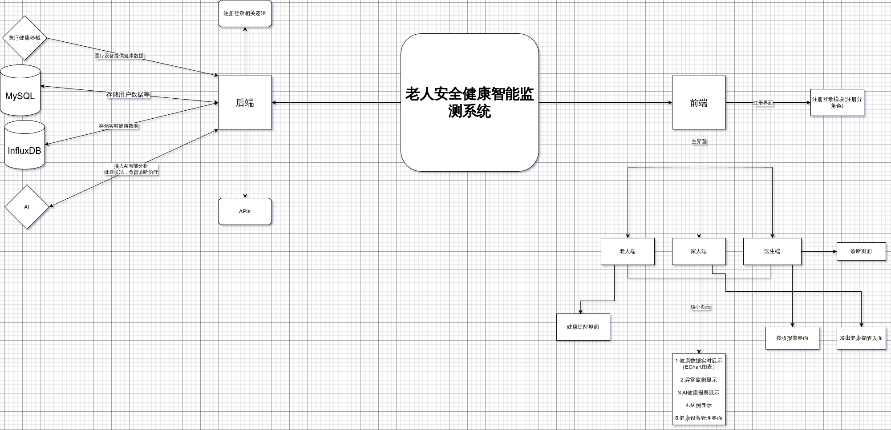
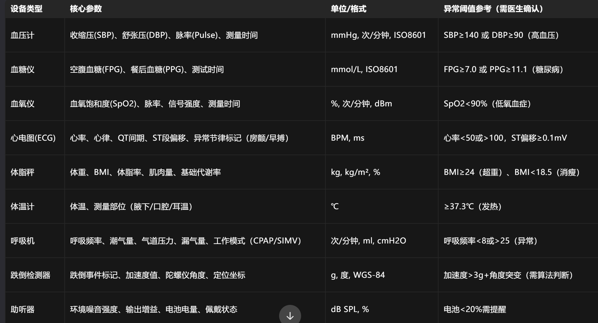

# B-EP2比赛项目开发文档（工业创新APP)

> 开发期限 6.9号
>
> 项目参与成员：薛晓春 邹佳明 吴由涛 冷丽娜 毛少龙 梁皓轩

## 任务：

1. 确定选题
2. 实践课程学习（刷网课)
3. 作品设计开发
4. 项目文档 -- pdf -- 包含项目背景、项目范围界定、项目流程、项目需求等
5. 演示视频 -- mp4 -- 5min内 介绍，演示

## 选题：**老人安全健康智能检测系统**

### 选题背景：

1. 老龄化社会挑战  ：

* 到2025年，我国60岁及以上老年人口将达3亿，占总人口超20%，慢性病管理与突发健康风险成为家庭和社会的核心痛点。

2. 政策支持  ：

* 国务院提出“解决老年人智能技术使用困难”，要求建设智慧健康养老终端设备标准及检测平台，推动适老化健康监测技术普及。

3. 市场空缺：

- 当前市场上的健康管理解决方案大多集中在年轻人或慢性病患者群体，针对老年人群的专属健康管理工具仍然稀缺。尤其是在老年人健康监测领域，现有的应用多以单一功能为主（如简单的健康数据记录或定位服务），缺乏系统性、智能化和互联互通的能力。

4. 与工业互联网紧密结合：

- 这一创新方向符合工业互联网在智慧医疗和健康管理领域的延伸应用，通过物联网、大数据和AI技术的深度融合，推动老年健康监护从传统模式向智能化、数字化转型。

### 需求分析：

#### **老人端（核心功能）**

* 健康数据监测展示 ：
* - 实时监测 ：通过智能手环/手表等医疗设备采集心率、血氧、血压、体温、睡眠质量等健康数据
* - 非接触监测  ：床头安装毫米波雷达或摄像头，监测呼吸频率、体动异常（如夜间离床未归）
* - * 环境监测  ：联动智能家居设备（如温湿度传感器、燃气报警器），预防中暑、火灾等风险
* 智能报警  ：
* - 分级报警  ：根据异常程度触发不同响应（如心率异常→短信通知家属；跌倒检测→自动联系急救中心）
* - * 语音交互 ：支持老人通过如智能音箱等设备一键呼救
* AI健康报表  ：
* 基于机器学习分析长期数据，生成健康趋势报告（如睡眠质量变化、慢性病风险预警）
* 结合《国民体质监测标准》

  提供个性化建议（如运动计划、饮食调整）。

#### **2. 家属端（远程监护）**

* 实时数据查看  ：
* - 通过APP查看老人实时健康状态（如心率曲线、活动轨迹）
* 报警与通知 ：
* - 接收紧急报警推送（如跌倒、离家异常），支持远程视频通话确认情况
* 健康档案管理  ：
* 存储病历、用药记录，设置服药提醒

#### **3. 医生端（专业干预）**

* 数据可视化与分析  ：
* 查看老人长期健康数据图表（如血压波动趋势、睡眠呼吸暂停频率）
* 结合AI辅助诊断（如通过心电数据识别房颤风险）

  * 远程诊疗支持  ：
  * 在线开具电子处方、调整用药方案，与家属端同步诊疗建议

## 技术栈：

* [ ] vue/uniapp
* [ ] nodejs/express
* [ ] mysql
* [ ] git

.............

## 预期开发流程：

---

## **5. 时间安排与里程碑**

### **第一阶段：需求分析与原型设计（1周）**

- 确定功能需求，完成低保真原型设计。
- 分配任务，明确每个模块的技术实现方案。

### **第二阶段：核心功能开发（3周）**

- 后端：完成健康数据接口、报警逻辑、AI模型集成。
- 前端：完成老人端、家属端、医生端的页面开发。

### **第三阶段：测试与优化（1周）**

- 测试所有功能模块，修复 Bug。
- 优化性能，确保系统稳定性和响应速度。

### **第四阶段：文档与演示准备（1周）**

- 撰写项目文档，制作演示视频。
- 准备答辩材料，模拟答辩。

---

通过以上分工方案，您可以充分利用团队成员的能力，同时避免重复劳动或任务遗漏。如果需要进一步细化某个模块的具体任务，请随时告知！

## 分工：

- **前端**：

  - 页面设计与开发（HTML/CSS/JavaScript/Vue）。
  - 数据可视化组件开发（如 ECharts、D3.js）。
- **后端**：

  - API 接口开发与调试。
  - 数据库设计与优化。
- **测试**：

  - 编写测试用例，执行功能测试和性能测试。
  - 记录测试结果，提交 Bug 报告。
- **文档编写**：

  - 项目背景、需求分析、技术架构等内容的撰写。
  - 制作演示视频脚本，录制和剪辑视频。

### **1. 后端开发（2人）**

#### **职责划分：**

- 两名后端开发者需要承担核心业务逻辑、接口设计以及前后端对接的任务。
- **分工建议**：
  - **开发者A**（技术栈熟悉者）：
    - 负责后端核心逻辑开发（如健康数据处理、报警规则引擎、AI模型调用等）。
    - 设计并实现前后端接口（RESTful API 或 WebSocket）。
    - 完成与前端的对接工作，确保接口稳定且文档清晰。
  - **开发者B**（辅助开发者）：
    - 负责数据库设计与管理（如表结构设计、SQL优化、数据存储逻辑）。
    - 实现基础功能模块（如用户认证、权限管理）。
    - 协助开发者A完成部分复杂逻辑开发（如报警分级逻辑、健康数据分析）。

#### **具体任务分配：**

##### **开发者A任务**：

1. 健康数据接口：
   - 接收前端上传的健康数据（如心率、血氧、血压等）。
   - 处理实时数据流并存储到数据库。
2. 报警逻辑：
   - 根据异常程度触发不同报警响应（短信通知家属、自动联系急救中心）。
3. AI模型集成：
   - 调用AI算法生成健康报表，并将结果返回给前端。
4. 前后端对接：
   - 编写接口文档，使用工具（如 Swagger）测试接口。

##### **开发者B任务**：

1. 数据库设计：
   - 创建健康数据表、报警记录表、用户信息表等。
   - 优化复杂查询（如长期健康趋势分析）。
2. 用户管理：
   - 实现用户注册、登录、权限控制（老人、家属、医生不同角色）。
3. 辅助功能开发：
   - 实现服药提醒、病历存储等功能。

---

### **2. 前端开发（4人）**

#### **职责划分：**

- 四名前端开发者虽然无项目经验，但刚学完 Vue，因此可以分配较为简单的模块任务。
- **分工建议**：
  - **开发者C & D**：负责老人端页面开发。
  - **开发者E & F**：负责家属端和医生端页面开发。

#### **具体任务分配：**

##### **开发者C & D任务（老人端）**：

1. 健康数据展示：
   - 开发实时健康数据展示页面（如心率曲线、睡眠质量图表）。
   - 使用 ECharts/D3.js 实现可视化图表。
2. 智能报警界面：
   - 开发报警功能界面（如弹窗提示、语音交互按钮）。
3. 环境监测：
   - 开发智能家居设备状态展示页面（如温湿度、燃气报警器状态）。

##### **开发者E & F任务（家属端 + 医生端）**：

1. 家属端：
   - 开发实时健康状态查看页面（如心率曲线、活动轨迹）。
   - 实现紧急报警推送功能（如弹窗通知、视频通话按钮）。
2. 医生端：
   - 开发健康数据可视化页面（如血压波动趋势图、睡眠呼吸暂停频率）。
   - 实现远程诊疗支持功能（如电子处方开具界面）。

---

### **3. 测试（全体协作）**

#### **职责划分：**

- 测试任务由全体成员共同完成，但后端开发者需要提供测试用例模板。
- **分工建议**：
  - **开发者A & B**：
    - 编写后端测试用例（如接口测试、性能测试）。
    - 使用工具（如 Postman、JMeter）进行自动化测试。
  - **开发者C-F**：
    - 编写前端测试用例（如界面交互测试、兼容性测试）。
    - 手动测试页面功能（如健康数据展示是否正常、报警功能是否触发）。

#### **具体任务分配：**

1. **后端测试**：
   - 接口测试：验证所有接口的功能是否正常。
   - 性能测试：模拟高并发场景，确保系统稳定性。
2. **前端测试**：
   - 功能测试：检查页面功能是否符合需求。
   - 兼容性测试：确保页面在不同浏览器和设备上表现一致。
3. **联合测试**：
   - 验证前后端联调是否正常（如健康数据实时更新、报警通知推送）。

---

### **4. 文档编写与版本控制（全员协作 + 明确负责人）**

#### **职责划分：**

- 文档编写和版本控制是团队协作的重要环节，需要明确一名负责人，其他成员协助完成。
- **分工建议**：
  - **文档负责人**：开发者A（对开发流程熟悉）。
  - **版本控制负责人**：开发者B（熟悉 Git 工具）。

#### **具体任务分配：**

1. **文档编写**：
   - 项目背景、需求分析：开发者A负责。
   - 技术架构、开发流程：开发者B负责。
   - 功能模块说明：前端开发者（C-F）分别撰写自己负责模块的文档。
2. **版本控制**：
   - 开发者B负责创建 Git 分支策略（如 feature 分支、main 分支）。
   - 定期合并代码，解决冲突。
   - 确保代码提交规范（如每次提交附带清晰的 commit message）。

## 基本架构图：



## 前后端接口约定：

#### **一、API 分类与功能概览**

| 类别                   | 核心功能                                  | 适用角色       |
| ---------------------- | ----------------------------------------- | -------------- |
| **用户认证**     | 注册、登录、令牌刷新、权限验证            | 老人/家属/医生 |
| **设备数据管理** | 设备绑定、实时数据接收、设备状态查询      | 老人           |
| **健康数据管理** | 健康数据存储、历史记录查询、数据聚合分析  | 老人/家属/医生 |
| **报警管理**     | 报警触发、报警记录查询、报警状态更新      | 老人/家属      |
| **AI 健康分析**  | 生成健康报告、风险预测、诊疗建议          | 医生           |
| **健康档案管理** | 用药记录增删改查、病历上传/下载、处方同步 | 家属/医生      |

---

#### **二、详细 API 列表与规范**

##### **1. 用户认证模块**

| 接口名称           | 方法 | 路径                      | 请求参数                      | 响应格式                                 | 说明                 |
| ------------------ | ---- | ------------------------- | ----------------------------- | ---------------------------------------- | -------------------- |
| **注册**     | POST | `/api/v1/auth/register` | `{ phone, password, role }` | `{ code: 200, data: { userId } }`      | 角色：老人/家属/医生 |
| **登录**     | POST | `/api/v1/auth/login`    | `{ phone, password }`       | `{ code: 200, data: { token, role } }` | 返回 JWT 令牌        |
| **令牌刷新** | POST | `/api/v1/auth/refresh`  | `{ refreshToken }`          | `{ code: 200, data: { token } }`       | 刷新访问令牌         |

##### **2. 设备数据管理模块**



| 接口名称               | 方法 | 路径                                      | 请求参数                                        | 响应格式                                     | 说明                   |
| ---------------------- | ---- | ----------------------------------------- | ----------------------------------------------- | -------------------------------------------- | ---------------------- |
| **绑定设备**     | POST | `/api/v1/devices/bind`                  | `{ userId, deviceSN, type }`          | `{ code: 200, message:deviceSN+'bind sucess!' }` | 类型：手环/其他医疗设备 |
| **解绑设备** | POST | `/api/v1/devices/unbind` | `{userId,deviceSN}` | `{code:200}` |  |
| **获取实时数据** | POST | `/api/v1/devices/data`                  | `{userId}` | `{ code: 200 ,deviceSN,type, data:{healthData} }` | 设备定时推送数据       |
| **查询设备状态** | GET  | `/api/v1/devices/:deviceSN/status`      | -                                               | `{ code: 200, data: { battery, online } }` | 在线状态、电量         |
| **查询设备列表**       | GET  | `/api/v1/devices/:userid/getDeviceList` | -                                               | `{ code: 200, data: { devicelist } }`      |                        |

##### **3. 健康数据管理模块**

| 接口名称               | 方法 | 路径                          | 请求参数                                 | 响应格式                                    | 说明                 |
| ---------------------- | ---- | ----------------------------- | ---------------------------------------- | ------------------------------------------- | -------------------- |
| **获取实时数据** | GET  | `/api/v1/health/real-time`  | `userId`                               | `{ heartRate, bloodPressure, ... }`       | WebSocket 长连接推送 |
| **查询历史数据** | GET  | `/api/v1/health/history`    | `{ userId, startTime, endTime, type }` | `{ data: [...] }`                         | 类型：心率/血压/血氧 |
| **数据聚合分析** | GET  | `/api/v1/health/statistics` | `{ userId, period: 'daily'/'weekly' }` | `{ avgHeartRate, maxBloodPressure, ... }` | 按日/周统计          |

##### **4. 报警管理模块**

| 接口名称               | 方法            | 路径                        | 请求参数                                           | 响应格式                   | 说明                  |
| ---------------------- | --------------- | --------------------------- | -------------------------------------------------- | -------------------------- | --------------------- |
| **触发报警**     | POST            | `/api/v1/alerts/trigger`  | `{ userId, type: 'fall'/'heartRate', location ,description}` | `{ code: 200, alertId }` | 自动通知家属/急救中心 |
| **查询报警记录** | GET             | `/api/v1//alerts:userId` | -      | `{code:200, data:alertId}` | 获取用户报警记录     |
| **更新报警状态** | POST | `/api/v1/alerts/update` | `{alertId, status: 'resolved'}` | `{code:200}`          | 家属确认后关闭报警    |

##### **5. AI 健康分析模块**

| 接口名称               | 方法 | 路径                       | 请求参数                                   | 响应格式                   | 说明                   |
| ---------------------- | ---- | -------------------------- | ------------------------------------------ | -------------------------- | ---------------------- |
| **生成健康报告** | POST | `/api/v1/ai/report`      | `{ userId, period: 'weekly'/'monthly' }` | `{ reportId, pdfUrl }`   | 异步任务，返回报告链接 |
| **获取健康建议** | GET  | `/api/v1/ai/suggestions` | `{ userId }`                             | `{ suggestions: [...] }` | 如运动计划、饮食调整   |

##### **6. 健康档案管理模块**

| 接口名称               | 方法 | 路径                                | 请求参数                                    | 响应格式                    | 说明             |
| ---------------------- | ---- | ----------------------------------- | ------------------------------------------- | --------------------------- | ---------------- |
| **添加用药记录** | POST | `/api/v1/records/medication`      | `{ userId, drugName, dosage, frequency }` | `{ code: 200, recordId }` | 同步至家属端     |
| **上传病历**     | POST | `/api/v1/records/medical-history` | `{ userId, file }` (multipart/form-data)  | `{ code: 200, fileUrl }`  | 支持PDF/图片格式 |
| **医生开具处方** | POST | `/api/v1/records/prescription`    | `{ userId, doctorId, content }`           | `{ code: 200 }`           | 家属端同步通知   |

---

#### **三、API 设计规范**

1. **统一响应格式**

   ```json
   {
     "code": 200,     // 状态码（200成功，401未授权，500错误）
     "message": "OK", // 提示信息
     "data": {}       // 业务数据
   }
   ```
2. **安全与鉴权**

   - **JWT 鉴权**：所有 API（除登录/注册）需在 Header 携带 `Authorization: Bearer {token}`。
   - **数据加密**：敏感字段（如密码、医疗数据）使用 RSA 非对称加密传输。
3. **性能优化**

   - **缓存策略**：高频查询接口（如历史数据）使用 Redis 缓存，过期时间 5 分钟。
   - **分页查询**：报警记录、历史数据接口支持 `page` 和 `pageSize` 参数。
4. **错误处理**

   - **400 Bad Request**：参数校验失败（如日期格式错误）。
   - **404 Not Found**：设备或用户不存在。
   - **503 Service Unavailable**：AI 服务超时。

---

#### **四、开发优先级建议**

| 优先级 | API 模块     | 必须实现接口                                       | 说明              |
| ------ | ------------ | -------------------------------------------------- | ----------------- |
| 高     | 用户认证     | `/auth/login`, `/auth/register`                | 系统入口          |
| 高     | 设备数据管理 | `/devices/data`, `/devices/bind`               | 数据采集基础      |
| 高     | 报警管理     | `/alerts/trigger`, `/alerts`                   | 核心业务风险控制  |
| 中     | 健康数据管理 | `/health/real-time`, `/health/history`         | 数据展示依赖      |
| 中     | 健康档案管理 | `/records/medication`, `/records/prescription` | 家属/医生协同关键 |
| 低     | AI 健康分析  | `/ai/report`, `/ai/suggestions`                | 依赖模型训练完成  |

---

#### **五、联调与测试工具**

1. **接口文档**：使用 **Swagger UI** 自动生成，路径 `/api-docs`。
2. **Mock 数据**：通过 Postman Mock Server 提供模拟响应，供前端并行开发。
3. **压力测试**：使用 **JMeter** 模拟高并发设备数据上报场景（目标：QPS ≥ 1000）。

---

通过此设计，后端可高效支撑 **老人端实时监测、家属端协同管理、医生端专业分析** 的全场景需求，且符合工业级应用的安全与性能标准。

---

---

---
